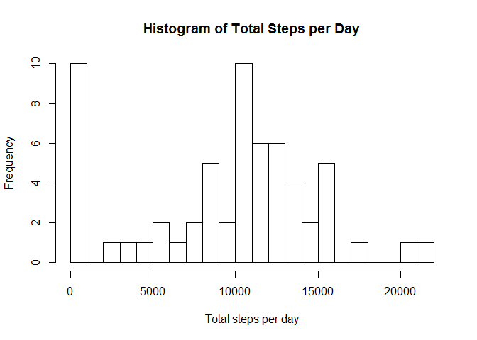
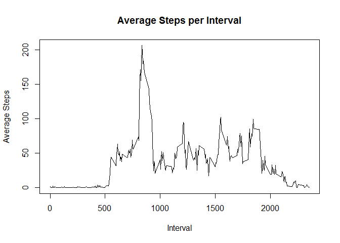
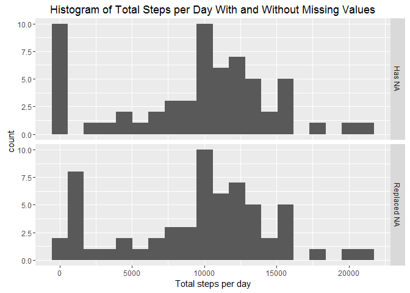
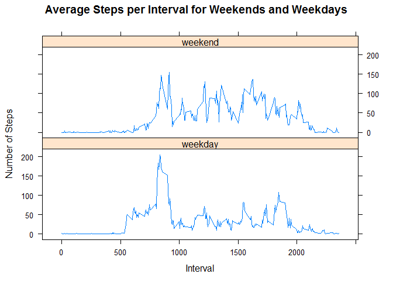

# Coursera Repoducible Research Course Project 1
Robert Beckman  
September 26, 2016  


# Loading and preprocessing the data.

Clear workspace and load libraries.


```r
rm(list = ls())
library(plyr)
library(ggplot2)
library(lattice)
```

### 1. Code for reading in the dataset and/or processing the data.


```r
temp <- tempfile(fileext = ".zip")
download.file("https://d396qusza40orc.cloudfront.net/repdata%2Fdata%2Factivity.zip",
              temp)
activity <- read.csv(unz(temp, "activity.csv"))
unlink(temp)
str(activity)
```

```
## 'data.frame':	17568 obs. of  3 variables:
##  $ steps   : int  NA NA NA NA NA NA NA NA NA NA ...
##  $ date    : Factor w/ 61 levels "2012-10-01","2012-10-02",..: 1 1 1 1 1 1 1 1 1 1 ...
##  $ interval: int  0 5 10 15 20 25 30 35 40 45 ...
```

# What is mean total number of steps taken per day?

Calculate the total number of steps taken per day


```r
activity.date <- ddply(activity,
                       .(date),
                       plyr::summarize,
                       sum_steps = sum(steps, na.rm = TRUE))
str(activity.date)
```

```
## 'data.frame':	61 obs. of  2 variables:
##  $ date     : Factor w/ 61 levels "2012-10-01","2012-10-02",..: 1 2 3 4 5 6 7 8 9 10 ...
##  $ sum_steps: int  0 126 11352 12116 13294 15420 11015 0 12811 9900 ...
```

### 2. Histogram of the total number of steps taken each day.

If you do not understand the difference between a histogram and a barplot,
research the difference between them. Make a histogram of the total number of
steps taken each day


```r
hist(
    activity.date$sum_steps,
    breaks = 20,
    main = "Histogram of Total Steps per Day",
    xlab = "Total steps per day"
)
```

<!-- -->

### 3. Mean and median number of steps taken each day.

Calculate and report the mean and median of the total number of steps taken per day


```r
mean(activity.date$sum_steps, na.rm = TRUE)
```

```
## [1] 9354.23
```

```r
median(activity.date$sum_steps, na.rm = TRUE)
```

```
## [1] 10395
```

# What is the average daily activity pattern?

### 4. Time series plot of the average number of steps taken.

Make a time series plot (i.e. type = "l") of the 5-minute interval (x-axis)
and the average number of steps taken, averaged across all days (y-axis)


```r
activity.interval <- ddply(activity,
                           .(interval),
                           plyr::summarize,
                           mean_steps = mean(steps, na.rm = TRUE))
plot(activity.interval$interval,
     activity.interval$mean_steps,
     type = "l", 
     main = "Average Steps per Interval",
     xlab = "Interval",
     ylab = "Average Steps")
```

<!-- -->

### 5. The 5-minute interval that, on average, contains the maximum number of steps.

Which 5-minute interval, on average across all the days in the dataset, contains the
maximum number of steps?


```r
activity.interval[activity.interval$mean_steps == max(activity.interval$mean_steps), "interval"]
```

```
## [1] 835
```

# Imputing missing values

Calculate and report the total number of missing values in the dataset (i.e.
the total number of rows with NAs)


```r
apply(activity, 2, function(x)
    sum(is.na(x)))
```

```
##    steps     date interval 
##     2304        0        0
```

```r
sum(apply(activity, 1, function(x)
    sum(sum(is.na(
        x
    )) > 0)))
```

```
## [1] 2304
```

### 6. Code to describe and show a strategy for imputing missing data.

Devise a strategy for filling in all of the missing values in the dataset. The
strategy does not need to be sophisticated. For example, you could use the
mean/median for that day, or the mean for that 5-minute interval, etc.


```r
steps2 <- ddply(activity,
                .(interval),
                plyr::summarize,
                median_steps = median(steps, na.rm = TRUE))
```

Create a new dataset that is equal to the original dataset but with the
missing data filled in.


```r
activity2 <- activity
activity2$id <- 1:nrow(activity2)
activity2 <- merge(activity2, steps2)
activity2 <- activity2[order(activity2$id), ]
activity2$id <- NULL
activity2$steps[is.na(activity2$steps)] <-
    activity2$median_steps[is.na(activity2$steps)]
activity2$median_steps <- NULL
activity2 <- activity2[, c(2, 3, 1)]

activity$missing_steps <- "Has NA"
activity2$missing_steps <- "Replaced NA"
activity3 <- rbind(activity, activity2)
activity3$missing_steps <- as.factor(activity3$missing_steps)

activity3.date <- ddply(activity3,
                        .(date, missing_steps),
                        plyr::summarize,
                        sum_steps = sum(steps, na.rm = TRUE))
str(activity3.date)
```

```
## 'data.frame':	122 obs. of  3 variables:
##  $ date         : Factor w/ 61 levels "2012-10-01","2012-10-02",..: 1 1 2 2 3 3 4 4 5 5 ...
##  $ missing_steps: Factor w/ 2 levels "Has NA","Replaced NA": 1 2 1 2 1 2 1 2 1 2 ...
##  $ sum_steps    : int  0 1141 126 126 11352 11352 12116 12116 13294 13294 ...
```

### 7. Histogram of the total number of steps taken each day after missing values are imputed.

Make a histogram of the total number of steps taken each day and Calculate and
report the mean and median total number of steps taken per day. Do these
values differ from the estimates from the first part of the assignment? What
is the impact of imputing missing data on the estimates of the total daily
number of steps?


```r
qplot(
    sum_steps,
    data = activity3.date,
    facets = missing_steps ~ .,
    bins = 20,
    main = "Histogram of Total Steps per Day With and Without Missing Values",
    xlab = "Total steps per day"
)
```

<!-- -->

```r
ddply(
    activity3.date,
    .(missing_steps),
    plyr::summarize,
    mean_sum_steps = mean(sum_steps, na.rm = TRUE),
    median_sum_steps = median(sum_steps, na.rm = TRUE)
)
```

```
##   missing_steps mean_sum_steps median_sum_steps
## 1        Has NA       9354.230            10395
## 2   Replaced NA       9503.869            10395
```

# Are there differences in activity patterns between weekdays and weekends?

Create a new factor variable in the dataset with two levels - "weekday" and
"weekend" indicating whether a given date is a weekday or weekend day.


```r
activity3$date <-
    as.POSIXlt(as.character(activity3$date), format = "%Y-%m-%d")
activity3$wd <- weekdays(activity3$date)

activity3[activity3$wd == "Monday", "wd"] <- "weekday"
activity3[activity3$wd == "Tuesday", "wd"] <- "weekday"
activity3[activity3$wd == "Wednesday", "wd"] <- "weekday"
activity3[activity3$wd == "Thursday", "wd"] <- "weekday"
activity3[activity3$wd == "Friday", "wd"] <- "weekday"
activity3[activity3$wd == "Saturday", "wd"] <- "weekend"
activity3[activity3$wd == "Sunday", "wd"] <- "weekend"
activity3$wd <- as.factor(activity3$wd)
str(activity3)
```

```
## 'data.frame':	35136 obs. of  5 variables:
##  $ steps        : int  NA NA NA NA NA NA NA NA NA NA ...
##  $ date         : POSIXlt, format: "2012-10-01" "2012-10-01" ...
##  $ interval     : int  0 5 10 15 20 25 30 35 40 45 ...
##  $ missing_steps: Factor w/ 2 levels "Has NA","Replaced NA": 1 1 1 1 1 1 1 1 1 1 ...
##  $ wd           : Factor w/ 2 levels "weekday","weekend": 1 1 1 1 1 1 1 1 1 1 ...
```

### 8. Panel plot comparing the average number of steps taken per 5-minute interval across weekdays and weekends

Make a panel plot containing a time series plot (i.e. type = "l") of the
5-minute interval (x-axis) and the average number of steps taken, averaged
across all weekday days or weekend days (y-axis).


```r
activity4 <- activity3[activity3$missing_steps == "Replaced NA", ]
activity5 <-
    aggregate(activity4$steps,
              by = list(interval = activity4$interval, wd = activity4$wd),
              mean)
colnames(activity5) <- c("interval", "wd", "steps")

xyplot(
    steps ~ interval |
        wd,
    data = activity5,
    layout = c(1, 2),
    type = "l",
    main = "Average Steps per Interval for Weekends and Weekdays",
    xlab = "Interval",
    ylab = "Number of Steps"
)
```

<!-- -->
